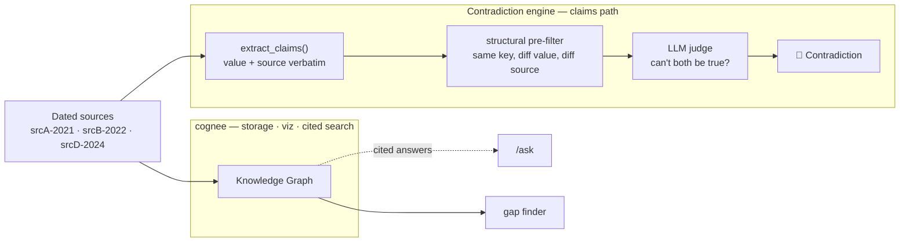

<div align="center">

# Crosscheck

**A research copilot that never forgets — and catches your sources contradicting each other.**

Built on [cognee](https://github.com/topoteretes/cognee). Runs fully offline on a local Llama.

[](https://www.python.org/)
[](https://github.com/topoteretes/cognee)
[](https://ollama.com/)
[](#license)

</div>

---

Most AI research tools have two blind spots: they **forget everything between sessions**, and they **never notice when two of your sources flatly disagree**. Crosscheck fixes both — persistent, graph-backed memory of everything you feed it, and a hero feature that flags contradictions between sources, with provenance.

```text
🚨 FooDB · throughput
   srcA-2021 (2021-03-01): 50,000 requests per second
   srcD-2024 (2024-09-01): 10,000 requests per second
   → same metric, same system, different values — they can't both be true.
```

> **▶ 2-minute demo:** _(add video link)_ · **Blog write-up:** [docs/blog.md](docs/blog.md)

> **Two apps, one engine.** Crosscheck has a sibling — **Argus**, a spend & contract *leakage* auditor that points the same contradiction engine at your invoices and puts a **dollar figure** on every mismatch ([jump to Argus](#argus--the-same-engine-pointed-at-money)). Run both behind one hub:
> ```bash
> uvicorn serve:app --port 8000     # → http://localhost:8000/  ·  /crosscheck/  ·  /argus/
> ```

---

## Why a knowledge graph

Answers **cite their sources**, and the graph makes disagreement between sources *visible* — something plain vector recall can't do. Every claim is tagged with **where** it came from and **when**, so a contradiction isn't just "two numbers differ" — it's "*this* source in 2021 vs *that* source in 2024."

## Features

- 🧠 **Persistent memory** — everything you ingest lives in cognee's stores; restart the process and the memory (and the contradictions) are still there.
- 🚨 **Contradiction detection** — a two-stage engine flags sources that can't both be true, naming both sources, dates, and the reason.
- 🔎 **Cited answers** — ask a question, get an answer grounded in the knowledge graph.
- 🕸️ **Live graph visualization** — cognee's interactive graph served in-app; Graph / Schema / Memory views.
- 🧭 **Gap finder** — ranks thinly-connected nodes and suggests what to research next (the self-improving loop).
- 🌐 **Live web ingestion** — pull fresh sources for a topic on demand.
- 🔌 **Provider-agnostic** — local Llama by default; OpenAI or Gemini is a drop-in env change, no code edits.

## Quickstart

**Prerequisites:** Python 3.10+, [Ollama](https://ollama.com/) running, and one of the LLM profiles below. The default is fully local and free.

```bash
# 1. Local models (default profile — free, offline, no API key)
ollama serve &
ollama pull llama3.1:8b
ollama pull nomic-embed-text

# 2. Configure + install
cp .env.example .env                 # default profile works as-is
uv pip install -e ".[baml]"          # BAML extra is required for the local-Llama path

# 3. Run
set -a && source .env && set +a
uvicorn crosscheck.api:app --port 8010
```

Open **http://localhost:8010**. Click **Ingest** (loads the FooDB demo pack) → the graph builds on the right → hit **Refresh** under Contradictions to see the 🚨 card.

Verify the whole pipeline headless:

```bash
python scripts/live_smoke.py         # prune → ingest → cognify → extract → print the contradiction
```

See [RUNBOOK.md](RUNBOOK.md) for the full walkthrough and the on-camera demo steps.

## Configuration

Provider is chosen entirely by env vars — pick one profile in [`.env.example`](.env.example), no code changes:

| Profile | Provider | Cost | Notes |
|---|---|---|---|
| **A** (default) | Local Llama via Ollama | Free, offline | The tested path. Needs `llama3.1:8b` + `nomic-embed-text`. |
| **B** | OpenAI | Paid, needs key | Strong models honor the schema — no BAML needed. |
| **C** | Google Gemini | Paid, needs key | Same as B. |

## How it works

Sources fan out **twice** — because the knowledge graph alone is the wrong source of truth for a *quantitative* contradiction on a small local model (it flattens `50,000 req/s` into a generic node and merges entities across sources, so the conflicting numbers never survive into the graph):



1. **cognee** handles storage, the graph visualization, and cited retrieval.
2. A thin **claim extractor** pulls faithful `(subject, predicate, object)` triples straight from each source's raw text, keeping the value **verbatim** with its source id and timestamp.
3. The **contradiction engine** runs on the claims: a deterministic structural pre-filter (no LLM) proposes candidates, then an LLM judge confirms each actually contradicts.

Full detail — including the three env tweaks that make cognify survive `llama3.1:8b` — is in [docs/architecture.md](docs/architecture.md).

## API

| Method | Route | Purpose |
|---|---|---|
| `GET`  | `/` | Web UI |
| `GET`  | `/graph` | cognee's interactive graph visualization |
| `GET`  | `/preset` | The FooDB demo source pack |
| `POST` | `/ingest` | Ingest sources (`{sources:[...]}`) or a live topic (`{live:true,topic:"..."}`) |
| `POST` | `/ask` | Cited answer (`{question:"..."}`) |
| `GET`  | `/contradictions` | Detected contradictions |
| `GET`  | `/gaps` | Suggested next research questions |

## Project layout

```text
crosscheck/
├── api.py            FastAPI app — thin wrapper over the units
├── claims.py         faithful claim extraction from raw source text
├── contradictions.py two-stage engine: structural pre-filter + LLM judge
├── gaps.py           gap finder — ranks thin nodes, asks for the next question
├── ingest.py         cognee ingestion (+ weak-model survival tweaks)
├── query.py          cited /ask over the graph
├── graph_access.py   graph read helpers
├── preset/           FooDB demo pack (one planted contradiction)
└── static/           web UI
argus/                sibling app — spend/contract leakage auditor
├── preset.py         3 planted cross-source leakage cases
├── impact.py         deterministic dollar-impact heuristic
├── audit.py          reuses find_contradictions → ranked findings + total
├── report.py         CSV export
├── api.py            FastAPI app (/leakage · /audit · /export.csv)
└── static/           tabbed UI (Overview · Input · How it works · Ask)
serve.py              single-port hub — mounts /crosscheck/ + /argus/
docs/                 architecture · demo scripts · blog · specs · social copy
scripts/              live_smoke.py · persistence_check.py
tests/                11 test modules (judge is injectable → offline)
```

## Testing

```bash
pytest                # judge and graph are injectable, so tests run with no network
```

## Known limitations

- **`/ask` is flaky on `llama3.1:8b`** — cognee's search-completion path uses a `str | None` field that BAML can't map on a small local model. It works on a hosted model (Profile B/C); the local demo leads with the graph + contradiction card. (Candidate upstream cognee issue.)
- **Contradiction detection reads extracted claims, not the knowledge graph** — by design; see [How it works](#how-it-works).
- **Schema & Memory graph views are light-themed** by cognee, independent of the dark Graph view.

## Argus — the same engine, pointed at money

Enterprises quietly lose 1–3% of spend to billing errors and unenforced contract terms: a negotiated discount that never gets applied, an invoice that bills more than the PO, tax charged above the contracted rate. Nobody cross-checks the paperwork line by line.

**Argus** reuses Crosscheck's contradiction engine **unchanged** — a contract line and an invoice line are just "the same fact with two different values" — and adds one thing: a **dollar figure** on each contradiction.

```text
Discount not applied          $2,400
  Contract ACME-2023 (2023-01-15): $2,400 early-pay credit due
  Invoice  INV-8842  (2024-06-03): $0 applied
  → Contract exceeds invoice by $2,400.
```

On the built-in demo pack it surfaces **$5,300** across 3 issues. A tabbed UI shows the findings, an **Input** tab to audit your own pasted docs, a **How-it-works** pipeline view, a scripted **Ask** assistant, and one-click **CSV export**.

```bash
uvicorn serve:app --port 8000        # → http://localhost:8000/argus/
# or standalone:  uvicorn argus.api:app --port 8020
```

Design + build notes: [docs/superpowers/specs/2026-07-05-argus-design.md](docs/superpowers/specs/2026-07-05-argus-design.md).

| Method | Route | Purpose |
|---|---|---|
| `GET`  | `/argus/` | Argus UI (Overview · Input · How it works · Ask) |
| `GET`  | `/argus/leakage` | Cached demo-pack findings + pipeline stage counts |
| `POST` | `/argus/audit` | Live leakage audit of pasted docs (`{sources:[...]}`) |
| `GET`  | `/argus/export.csv` | Findings as a finance-ready CSV |

## Acknowledgements

Built on [**cognee**](https://github.com/topoteretes/cognee) — storage, the knowledge graph, visualization, and cited retrieval. Crosscheck adds the contradiction engine, gap finder, and UI on top.

## License

MIT — see [LICENSE](LICENSE).
