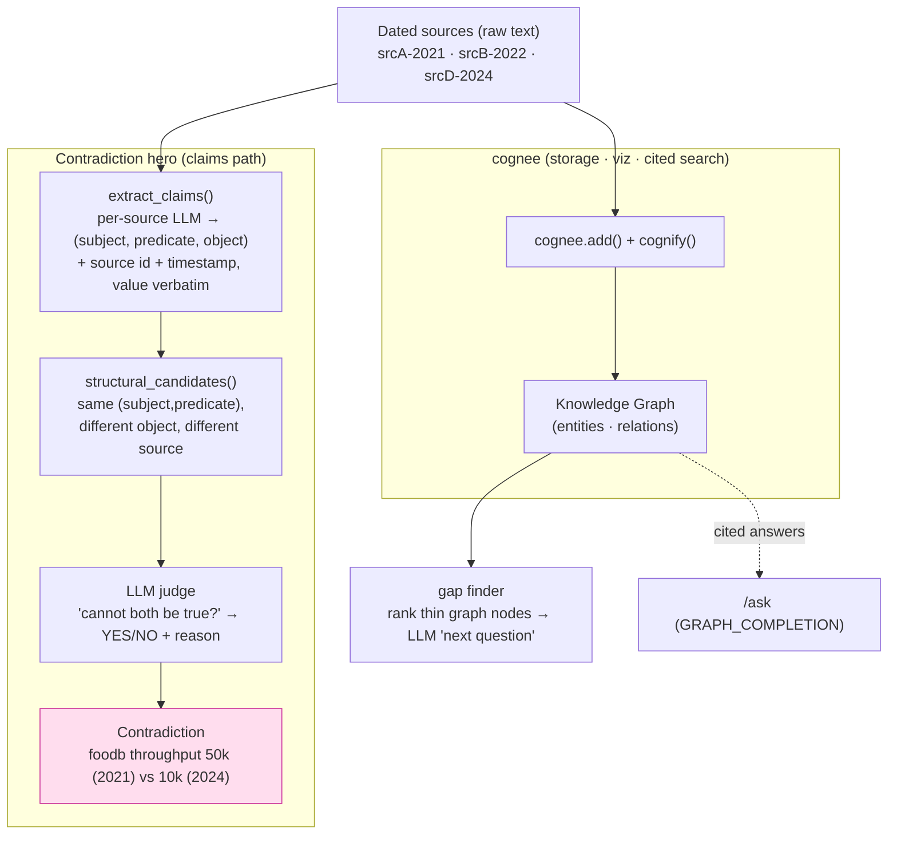

# Crosscheck architecture

## Pipeline



## Why two paths from the sources

The knowledge graph is the wrong source of truth for a *quantitative*
contradiction on a small local model:

- extraction flattens `50,000 requests per second` → a generic
  `requests per second` node (number dropped);
- the same entity is merged across sources, so the two throughput edges dedup
  into one — nothing left to compare.

So sources fan out **twice**: into cognee (for storage, the graph visualization,
and cited retrieval) **and** into a thin claim extractor that keeps the value
verbatim with its provenance. The contradiction engine runs on the claims.

## Contradiction engine (two stages)

1. **Structural pre-filter** (`contradictions.structural_candidates`) — pure,
   no LLM. Group claims by normalized `(subject, predicate)`; a pair is a
   candidate iff `object` differs **and** `source` differs. Cheap, deterministic,
   unit-tested offline.
2. **LLM judge** (`contradictions.default_llm_judge`) — confirm each candidate
   actually contradicts ("cannot both be true"), returns YES/NO + reason. Only
   candidates reach the model, so judge calls are few.

`find_contradictions(triplets, judge=None)` wires the two; `judge` is injectable
so tests run with a stub — no network.

## Running weak local models under cognee

Three env settings (all in `.env.example`) make cognify survive llama3.1:8b:

| Setting | Why |
|---|---|
| `STRUCTURED_OUTPUT_FRAMEWORK=baml` + `BAML_LLM_*` → Ollama | BAML's schema-aligned parsing tolerates the loose JSON small models emit; the default `instructor` path raises and aborts cognify. |
| `_defang_summarization()` in `ingest.py` | cognee's chunk-summarization demands a schema llama3.1:8b won't satisfy; we swap it for naive truncation (Crosscheck never reads summaries). |
| `ENABLE_BACKEND_ACCESS_CONTROL=false` | Multi-user scoping splits the graph per user, so a direct `get_graph_data()` read returns empty. |
```
